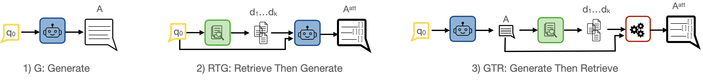

# An Evaluation Framework for Attributed Information Retrieval using Large Language Models

This is the original implementation of the framework in the paper [An Evaluation Framework for Attributed Information Retrieval using Large Language Models](https://arxiv.org/abs/2409.08014) (CiKM 2024). 
Search engines are now adopting generative approaches to provide  answers along with in-line citations as attribution. While existing work focuses mainly on attributed question answering (QA), we target information-seeking scenarios which are often more challenging. This repository maintains a framework to evaluate and benchmark attributed information seeking. We implement three key architectures commonly used for attribution, extendable to any LLM or LLM-based approach: (1) Generate (2) Retrieve then Generate, and (3) Generate then Retrieve. We also provide several automatic evaluation metrics for attributed information seeking from literature and propose possible adptations. Baselines and experiments are run using [HAGRID](https://github.com/project-miracl/hagrid) dataset two LLMs : [Zephyr 3b](https://huggingface.co/stabilityai/stablelm-zephyr-3b) and [LLaMA-2-chat](https://huggingface.co/meta-llama/Llama-2-7b-chat-hf) . But can easily extend to other LLMs and other datasets for the task.



## Content
1. [Installation](#installation)
2. [Architectures](#architectures)
3. [Evaluation](#evaluation)
5. [Extension to Custom Data and Models](#extension-to-custom-data-and-models)
6. [Results](#results)
7. [Contact](#contact)
## Installation
Install dependent Python libraries by running the command below.

```
pip install -r requirements.txt
```

You can also create a conda environment by running the command below.

```
conda env create -f environment.yml
```
Activate the environment afterwards 

```
conda activate llms-env
```
## Architectures

The different architectures of LLM can be found in `scripts`. The configurations to reproduce our work are already stored in `config.py` but you can adjust as needed by including arguments or directly modifying the `config.py` file (see section [Extension to Custom Data and Models](#extension-to-custom-data-and-models) ).

#### Generate (G)

A simple run of the script specifying the architecture and the model :

```
python scripts/generate_answer.py  --architcture G --model_name zephyr
```

#### Retrieve Then Generate (RTG)
For this architecture, we need first to retrieve the documents, then use them for answer generation
##### RTG-gold
If the dataset has annotated relevant documents i.e. gold documents,  we can run the generation directly without retrieval.
```
python scripts/generate_answer.py  --architcture RTG-gold --model_name zephyr 
```
##### RTG-vanilla
First run the retrieval script :

```
python scripts/retrieve.py
```

Once the retrieval is done, you can then run the next command. To reproduce the results in the paper the `config.py` already has the correct name of the retrieval file stored. However you can always provide your own retrieval file via argument `--retrieved_passages_file` (for more details see section [Extension to Custom Data and Models](#extension-to-custom-data-and-models)) : 
```
python scripts/generate_answer.py --architcture RTG-vanilla --model_name zephyr
```

##### RTG-query-gen
First generate the queries:

```
python scripts/generate_queries.py  --model_name zephyr
```
Then we retrieve using the generated queries. By default the aggregation method is "rerank" but can be modified in `config.py`:

```
python scripts/retrieve_with_generated_queries.py
```

Then run the answer generation script specifying the architecture:
```
python scripts/generate_answer.py  --architcture RTG-query-gen --model_name zephyr
```

#### Generate Then Retrieve (GTR)
If you have not run the experiment G (Generate), you have to do so. Then run :

```
python scripts/retrieve_posthoc_gtr.py
```


## Evaluation

We evaluate both the correctness and attribution of the answer. We take in consideration the case where multiple answers are possible. We also offer the evaluation of retrieval results

### Correctness
To evaluate correctness run (the multiple_gold_answers is True by default) : 

```
python scripts/evaluate_correctness.py --architcture {G/RTG-gold/RTG-vanilla/RTG-query-gen} 
```
### Attribution
For attribution metrics the argument `--autoais` specifies which type of metric to run : a) for AutoAIS-cit `--autoais Cit`  b) for AutoAIS-Pssg `--autoais Pssg`  c) for ALCE precision/recall `--autoaisALCE`. Add the argument  `--overlap` to have the citation overlap pricision/recall.

```
python scripts/citations_eval.py --architcture {G/RTG-gold/RTG-vanilla/RTG-query-gen} --autoais {Cit, Pssg, ALCE} --overlap
```

For retrieval:

```
python scripts/evaluate_retrieval.py
```

## Extension to Custom Data and Models

This code can be extended to different LLMs, and different datasets. We experiment with Zephyr-3b and Llama-2-chat-7b, with HAGRID dataset. The file `config.py` stores all configurations for easy reproduction of our work. Modifications can be applied either by using command-line arguments (will override the configuration in `config.py`) or by directlying modify `config.py`.

### LLM
The scripts  `scripts/generate_answer.py` and `scripts/generate_queries.py` both take argument `--model_id` which can be a valid huggingface model id. You can also specify whether you want the model to be loaded in 4bits. For example:

```
python scripts/generate_answer.py --model_id {HuggingFaceH4/zephyr-7b-beta,..} --load_in_4bits
```
You can specify more LLM parameters (temperature, max tokens, etc) in `config.py` by manipulating `langauge_model` in the `CONFIG` dictionary (line 267)

### Dataset

We use HAGRID dataset to run our experiments, but this code can be easily applicable to other datasets from huggingfce or from custom files, provided that the dataset contains these fields: 

_query_ : the question or the query

_answers_ : [only needed for evaluation] list of possible gold answers (can be one or more)

_quotes_ : [only needed for certain architectures] documents used as context to generate the answer (Not needed for architecture Generate (G))


For easy applications, we leave column names changeable. In `config.py`, in the `CONFIG` dictionary (line 265-283), you can specify the names of the columns.

#### Dataset From HuggingFace

If the dataset is available on Huggingface, you can directly provide the valid dataset id via the argument  `--dataset` or in `config.py`> `CONFIG:dict` > `dataset` , as well as the split (test, dev, train) by default it's set to 'dev' . For example 
```
python scripts/generate_answer.py --model_id {HuggingFaceH4/zephyr-7b-beta,..} --dataset {miracl/hagrid,..} --split {dev,test,train}
```
for retrieval a name of an index from pyserini is additionally required

```
python scripts/retrieve.py --dataset {miracl/hagrid,..} --split {dev,test,train} --index "miracl-v1.0-en"
```
#### Dataset From local file

You can directly provide the path towards a dataset file (with minimum the queries column) via the argument  `--data_path` or in `config.py`> `CONFIG:dict` > `data_path` . For example (ASQA dataset)
```
python scripts/generate_answer.py --model_id {HuggingFaceH4/zephyr-7b-beta,..} --data_path ./data/asqa_eval_gtr_top100.json
```

### Additional Parameters

The results file name is in `config.py` by architecture, but can be overridden by command-line arguments  `--results_file`
For RTG setting, the retrieved documents can be provided from an external file via the argument `--retrieved_passages_file` and the number of documents to be used can set via `--nb_passages` 


## Results
We test the frame on two LLMs: [Zephyr 3b](https://huggingface.co/stabilityai/stablelm-zephyr-3b) and [LLaMA-2-chat](https://huggingface.co/meta-llama/Llama-2-7b-chat-hf)
*Gold answer* reports the citation quality in the gold answer using automatic metrics. Since the scenario *G* does not include citations, only answer correctness is evaluated. Since the generated answer in scenario *GTR* is the same as in scenario *G*, the answer correctness measures are equal. The best performance measures are in **bold**.
#### Zephyr-3b
<sub><sup>
<table >
  <tr>
    <th rowspan="2">   Scenarios   </th> 
    <th colspan="7">Correctness</th>
    <th colspan="6">Citations</th>
  </tr>
  <tr>
    <th>BLEU</th>
    <th>ROUGE Prec</th>
    <th>ROUGE Rec</th>
    <th>ROUGE F-score</th>
    <th>BertScore Prec</th>
    <th>BertScore Rec</th>
    <th>BertScore F-score</th>
    <th>Overlap Prec</th>
    <th>Overlap Rec</th>
    <th>AutoAIS Cit.</th>
    <th>AutoAIS Pssg.</th>
    <th>NLI Prec.</th>
    <th>NLI Rec.</th>
  </tr>
  <tr>
    <td>Gold answer</td>
    <td></td>
    <td>-</td>
    <td>-</td>
    <td>-</td>
    <td>-</td>
    <td>-</td>
    <td>-</td>
    <td>-</td>
    <td>-</td>
    <td>87.97</td>
    <td>89.21</td>
    <td>83.65</td>
    <td>79.80</td>
  </tr>
  <tr>
    <td>G</td>
    <td>11.06</td>
    <td>30.41</td>
    <td>46.08</td>
    <td>31.58</td>
    <td>87.88</td>
    <td>90.02</td>
    <td>88.87</td>
    <td>-</td>
    <td>-</td>
    <td>-</td>
    <td>-</td>
    <td>-</td>
    <td>-</td>
  </tr>
  <tr>
    <td>RTG - gold</td>
    <td><b>28.22</b></td>
    <td><b>44.00</b></td>
    <td><b>63.81</b></td>
    <td><b>46.72</b></td>
    <td><b>90.02</b></td>
    <td><b>93.36</b></td>
    <td><b>91.69</b></td>
    <td><b>75.29</b></td>
    <td><b>68.89</b></td>
    <td><b>42.81</b></td>
    <td><b>80.67</b></td>
    <td>56.55</td>
    <td><i>42.31</i></td>
  </tr>
  <tr>
    <td>RTG - vanilla (2-psg)</td>
    <td><i>18.44</i></td>
    <td><i>33.83</i></td>
    <td><i>56.40</i></td>
    <td><i>36.65</i></td>
    <td><i>87.94</i></td>
    <td>91.52</td>
    <td><i>89.63</i></td>
    <td><i>36.17</i></td>
    <td><i>32.69</i></td>
    <td>41.86</td>
    <td>78.95</td>
    <td><i>57.90</i></td>
    <td>41.63</td>
  </tr>
  <tr>
    <td>RTG - query-gen (2-psg)</td>
    <td>18.33</td>
    <td>33.58</td>
    <td>56.13</td>
    <td>36.43</td>
    <td>87.89</td>
    <td><i>91.55</i></td>
    <td>89.62</td>
    <td>35.89</td>
    <td>32.46</td>
    <td><i>42.68</i></td>
    <td><i>80.10</i></td>
    <td><b>59.59</b></td>
    <td><b>42.48</b></td>
  </tr>
  <tr>
    <td>GTR (1-psg)</td>
    <td>11.06</td>
    <td>30.41</td>
    <td>46.08</td>
    <td>31.58</td>
    <td>87.88</td>
    <td>90.02</td>
    <td>88.87</td>
    <td>45.53</td>
    <td>30.53</td>
    <td>26.69</td>
    <td>26
    </td>
  </tr>
</table>
</sub></sup>

#### LLaMA-2-chat-7b
<sub><sup>
<table >
  <tr>
    <th rowspan="2">   Scenarios   </th> 
    <th colspan="7">Correctness</th>
    <th colspan="6">Citations</th>
  </tr>
  <tr>
    <th>BLEU</th>
    <th>ROUGE Prec</th>
    <th>ROUGE Rec</th>
    <th>ROUGE F-score</th>
    <th>BertScore Prec</th>
    <th>BertScore Rec</th>
    <th>BertScore F-score</th>
    <th>NLI Prec.</th>
    <th>NLI Rec.</th>
    <th>AutoAIS Cit.</th>
    <th>AutoAIS Pssg.</th>
    <th>Overlap Prec</th>
    <th>Overlap Rec</th>
  </tr>
  <tr>
    <td>Gold answer</td>
    <td></td>
    <td>-</td>
    <td>-</td>
    <td>-</td>
    <td>-</td>
    <td>-</td>
    <td>-</td>
    <td>87.97</td>
    <td>89.21</td>
    <td>83.65</td>
    <td>79.80</td>
    <td>-</td>
    <td>-</td>
  </tr>
  <tr>
    <td>G</td>
    <td> 13.43</td>
    <td>31.14</td>
    <td>50.21</td>
    <td>34.43</td>
    <td>87.21</td>
    <td>89.98</td>
    <td>88.53</td>
    <td>-</td>
    <td>-</td>
    <td>-</td>
    <td>-</td>
    <td>-</td>
    <td>-</td>
  </tr>
  <tr>
    <td>RTG - gold</td>
    <td><b>15.04</b></td>
    <td><b>22.58</b></td>
    <td><b>71.03</b></td>
    <td>30.75</td>
    <td>84.87</td>
    <td>91.61</td>
    <td><b>88.07</b></td>
    <td><b>83.79</b></td>
    <td><b>52.44</b></td>
    <td><b>26.76</b></td>
    <td>64.03</td>
    <td><b>91.65</b></td>
    <td>26.81</td>
  </tr>
  <tr>
    <td>RTG - vanilla (2-psg)</td>
    <td>10.58</td>
    <td>17.62</td>
    <td><i>60.23</i></td>
    <td><i> 24.03</i></td>
    <td><i>83.62</i></td>
    <td>89.70</td>
    <td><i>86.52</i></td>
    <td><i>27.71</i></td>
    <td><i>53.49</i></td>
    <td>27.98</td>
    <td>62.40</td>
    <td>36.03</td>
    <td><i>41.13</i></td>
  </tr>
  <tr>
    <td>RTG - query-gen (2-psg)</td>
    <td>10.88</td>
    <td>17.84</td>
    <td>60.36</td>
    <td>24.36</td>
    <td>83.74</td>
    <td><i>89.78</i></td>
    <td>86.61</td>
    <td>28.84</td>
    <td>54.61</td>
    <td><i>29.26</i></td>
    <td>62.37</td>
    <td><i>36.94 </i></td>
    <td><b>41.95</b></td>
  </tr>
  <tr>
    <td>GTR (1-psg)</td>
     <td>13.43</td> 
     <td>31.14</td> 
     <td>50.21</td>
     <td>34.43</td> 
     <td>87.21</td>
     <td>89.98</td>
     <td>88.53</td> 
     <td>26.69</td>
     <td>26.65</td>
     <td>26.66</td>
     <td>26.65</td>
     <td>6.28</td>
     <td>4.28</td>

    
  </tr>
</table>
</sub></sup>

## Contact
If you have questions, please open an issue mentioning @hanane-djeddal or send an email to hanane.djeddal[at]irit.fr.

